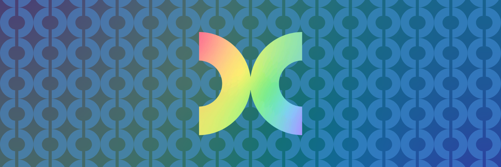

# Hey, I'm Pip

Graphic design & dev enthusiast from Hertfordshire — I make things look good *and* work well.
I specialise in **branding**, **web design**, **IoT**, and **creative technology**.

🌐 [pipchell.com](https://pipchell.com) · 📁 [All Projects](https://pipchell.com/directory)

---

## What I work with

 
(and a bit of)

---

## A bit about me

- I care a lot about design details
- I build IoT stuff and weird little web projects for fun
- Contact me at [pipchell.com/me](https://pipchell.com/me)
